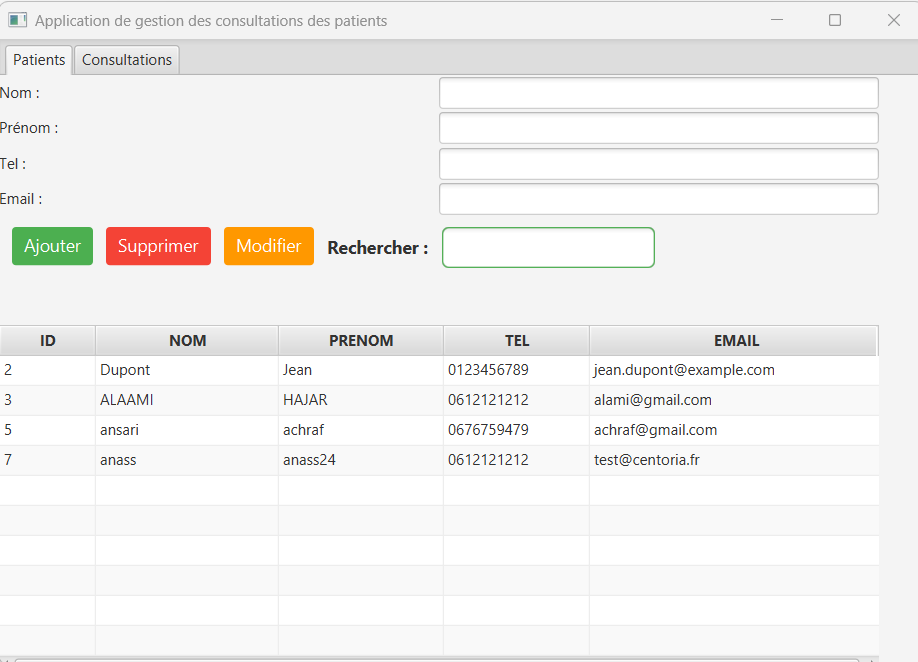
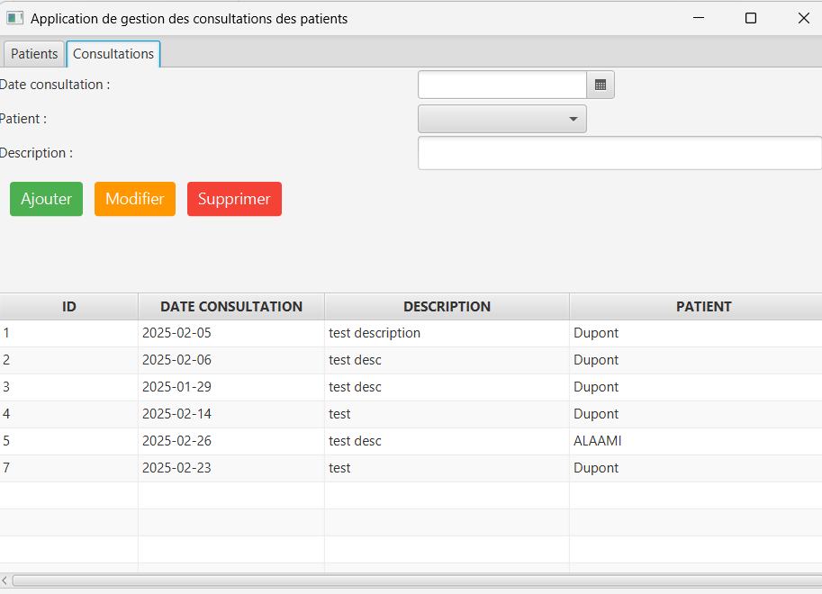

# Application de Gestion des Consultations et des Patients

Une application JavaFX permettant de gérer les patients et leurs consultations, avec des fonctionnalités complètes pour l'ajout, la modification, la suppression et la recherche.

## Fonctionnalités

### **Gestion des Patients**
✅ Ajouter un patient  
✅ Modifier les informations d'un patient  
✅ Supprimer un patient  
✅ Rechercher des patients via un champ de recherche  
✅ Afficher la liste des patients sous forme de tableau

### **Gestion des Consultations**
✅ Ajouter une nouvelle consultation pour un patient  
✅ Modifier les détails d'une consultation  
✅ Supprimer une consultation
✅ Enregistrer l'historique des consultations pour chaque patient  

## Technologies utilisées

- **Java 17+** (ou une version compatible)
- **JavaFX** pour l'interface utilisateur
- **JDBC + MySQL/PostgreSQL** pour la gestion de la base de données
- **Maven** (ou Gradle) pour la gestion des dépendances

## Aperçu de l'interface

📌 **patients**  

📌 **consultations**  

